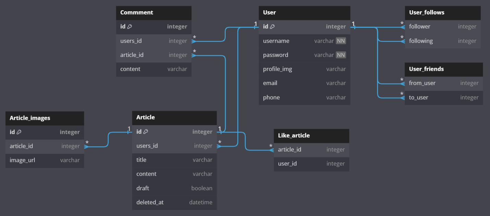

# LIKELION-MissionTypeProject-2nd

---
## 📮멋사SNS📮️


> **개인 미션형 프로젝트** <br/> **제작자: 권선녀** [@sssssn](https://github.com/sssssn) <br/> **제작 기간: 2023.08.03 ~ 2023.08.08**

## 프로젝트 소개 🦁
주요 소셜 미디어 기능들을 참고하여 사용자 간의 상호 작용을 통해 **개인의 피드를 관리하고 공유할 수 있는 플랫폼의 백엔드**를 만들어 보는 미션형 프로젝트입니다. </br>
1. 인증된 사용자가 프로필 관리를 하고
2. 피드를 자유롭게 올리고
3. 댓글과 좋아요 기능을 통해 소통하며
4. 사용자 간의 팔로우 및 친구 관계를 가질 수 있는 형태

---
## 시작 가이드 🌈
### Environments
For building and running the project you need:

- IntelliJ Ultimate
- Spring Boot 3.1.2
    - Build Tool: Gradle
    - Dependencies:
        - Spring Boot DevTools
        - Lombok
        - Spring Web
        - Spring Data JPA
        - Spring Boot Starter Security
        - Spring Boot Starter Thymeleaf
        - Spring Boot Starter Validation
        - JSON Web Token for Java (jjwt)

---
## Stacks 👩🏻‍💻
### Environment


### Development


 <br/>


### Communication


---
## 주요 기능 🌟

### 1️⃣ 사용자 인증 (Authentication)
- 사용자의 신원을 확인하는 것을 목적으로 [토큰 기반 인증 시스템](https://github.com/likelion-backend-5th/Project_2_KwonSunNyeo/commits/day1) 구현
- 사용자의 로그인 상태에 따라 접근 권한이 다르게 적용
- 로그인 성공 시 사용자에게 토큰을 제공하며, 이후 요청 시 토큰을 이용하여 인증
- 로그인과 회원가입 필수 정보로 아이디와 비밀번호가 요구되며, 추가적으로 이메일과 전화번호 입력 가능
- 로그인 상태에서 프로필 이미지 업로드 가능
- <details>
    <summary>💡상세 구현 내용</summary>

    - `UserController` 를 통해 로그인, 로그아웃, 회원가입 기능 구현
    - `UserEntity` 를 통해 사용자 인증 정보를 데이터베이스에 저장하기 위한 엔티티 클래스 생성
    - `UserRepository` 를 통해 JPA를 이용한 사용자 관리 기능과 사용자 이름으로 정보 로드 기능 추가
    - `JwtUtils` `JwtFilter` 를 통해 JWT 토큰 인증 및 필터 기능 추가
</details>

### 2️⃣ 피드 관리 (Feed Management)
- 사용자와 게시글, 댓글 간의 [관계 설정](https://github.com/likelion-backend-5th/Project_2_KwonSunNyeo/commits/day2)을 통해 데이터의 논리적 연결성 강화
- 피드에는 제목, 내용, 그리고 여러 이미지 등록 가능
- 피드 조회, 수정, 삭제 기능이 제공되며, 이미지의 추가 및 삭제 기능도 제공
- 각 사용자는 여러 개의 게시글, 댓글을 가질 수 있으며, 이들 간의 관계는 데이터베이스 상에서 표현
    - **ERD** (Entity Relationship Diagram) <br/> 
- <details>
    <summary>💡상세 구현 내용</summary>

    - `Article, Comment, UserEntity` 를 통해 각 엔티티 사이의 관계 설정
    - `WebSecurityConfig` 를 통해 권한에 따른 접근 제한 설정 추가
    - `CustomException` `CustomExceptionHandler` 를 통해 예외 발생 시 적절한 HTTP 상태 코드와 함께 사용자에게 의미 있는 메시지 전달
    - `CustomExceptionCode` 를 통해 서비스 로직 내에서 발생하는 예외들을 커스텀 예외로 처리하고, 각 예외에 맞는 응답 메시지 및 상태 코드 반환
</details>

### 3️⃣ 상호 작용 (Interactions)
- 사용자 간의 상호 작용을 위한 [댓글 및 좋아요](https://github.com/likelion-backend-5th/Project_2_KwonSunNyeo/commits/day3) 기능 구현
- 피드에 대한 댓글 작성, 수정, 삭제 및 좋아요 기능 지원
- 본인의 피드에는 좋아요를 할 수 없으며, 이미 좋아요한 피드에 대해서는 좋아요 취소 기능 제공
- <details>
    <summary>💡상세 구현 내용</summary>

    - `*Controller` 를 통해 각 기능별 사용자 권한 검증 로직 설정
    - `*Controller` 를 통해 사용자에게 좋아요 상태를 토글(toggle)하는 기능 제공
</details>

### 4️⃣ 사용자 간의 관계 (User Relations)
- 팔로우 및 친구 맺기 기능을 통해 사용자 간의 관계를 형성
- 사용자는 다른 사용자를 팔로우하거나 친구 요청을 보낼 수 있음
- 팔로우는 일방적인 관계이며, 친구 관계는 양방향 관계로 형성
- 친구 요청을 받은 사용자는 요청을 수락 또는 거절 가능
- <details>
    <summary>💡상세 구현 내용</summary>

    - ⚠️ 미구현
</details>

#### 📑 총평 및 자료
- 로그를 통해 에러 발생 이유를 세세하게 배우게 되었으며 [지난 프로젝트](https://github.com/likelion-backend-5th/Project_1_KwonSunNyeo)에서 예외 처리, 메서드 분리 등과 같은 아쉬운 점을 개선했으나, 모든 요구사항을 구현하지 못하고 코드 리팩토링을 완료하지 못하여 다른 의미로 아쉬움
- [포스트맨 API 문서](https://documenter.getpostman.com/view/28055949/2s9Xy2MrGw)

---
## Architecture 📦

### 디렉토리 구조
<details>
<summary>여기를 눌러주세요!🌱</summary>

```bash
📦sns
 ┣ 📂gradle
 ┃ ┗ 📂wrapper
 ┃ ┃ ┣ 📜gradle-wrapper.jar
 ┃ ┃ ┗ 📜gradle-wrapper.properties
 ┣ 📂src
 ┃ ┣ 📂main
 ┃ ┃ ┣ 📂java
 ┃ ┃ ┃ ┗ 📂com
 ┃ ┃ ┃ ┃ ┗ 📂likelion
 ┃ ┃ ┃ ┃ ┃ ┗ 📂sns
 ┃ ┃ ┃ ┃ ┃ ┃ ┣ 📂config
 ┃ ┃ ┃ ┃ ┃ ┃ ┃ ┣ 📜PasswordEncoderConfig.java
 ┃ ┃ ┃ ┃ ┃ ┃ ┃ ┗ 📜WebSecurityConfig.java
 ┃ ┃ ┃ ┃ ┃ ┃ ┣ 📂exception
 ┃ ┃ ┃ ┃ ┃ ┃ ┃ ┣ 📜CustomException.java
 ┃ ┃ ┃ ┃ ┃ ┃ ┃ ┣ 📜CustomExceptionCode.java
 ┃ ┃ ┃ ┃ ┃ ┃ ┃ ┗ 📜GlobalExceptionHandler.java
 ┃ ┃ ┃ ┃ ┃ ┃ ┣ 📂jwt
 ┃ ┃ ┃ ┃ ┃ ┃ ┃ ┣ 📜TokenExceptionFilter.java
 ┃ ┃ ┃ ┃ ┃ ┃ ┃ ┣ 📜TokenFilter.java
 ┃ ┃ ┃ ┃ ┃ ┃ ┃ ┗ 📜TokenUtils.java
 ┃ ┃ ┃ ┃ ┃ ┃ ┣ 📂user
 ┃ ┃ ┃ ┃ ┃ ┃ ┃ ┣ 📂dto
 ┃ ┃ ┃ ┃ ┃ ┃ ┃ ┃ ┣ 📜MessageResponseDto.java
 ┃ ┃ ┃ ┃ ┃ ┃ ┃ ┃ ┣ 📜TokenResponseDto.java
 ┃ ┃ ┃ ┃ ┃ ┃ ┃ ┃ ┣ 📜UserLoginDto.java
 ┃ ┃ ┃ ┃ ┃ ┃ ┃ ┃ ┗ 📜UserRegisterDto.java
 ┃ ┃ ┃ ┃ ┃ ┃ ┃ ┣ 📜CustomUserDetails.java
 ┃ ┃ ┃ ┃ ┃ ┃ ┃ ┣ 📜CustomUserDetailsManager.java
 ┃ ┃ ┃ ┃ ┃ ┃ ┃ ┣ 📜UserController.java
 ┃ ┃ ┃ ┃ ┃ ┃ ┃ ┣ 📜UserEntity.java
 ┃ ┃ ┃ ┃ ┃ ┃ ┃ ┣ 📜UserRepository.java
 ┃ ┃ ┃ ┃ ┃ ┃ ┃ ┗ 📜UserService.java
 ┃ ┃ ┃ ┃ ┃ ┃ ┣ 📂article
 ┃ ┃ ┃ ┃ ┃ ┃ ┃ ┣ 📂dto
 ┃ ┃ ┃ ┃ ┃ ┃ ┃ ┃ ┣ 📜ArticleListResponseDto.java
 ┃ ┃ ┃ ┃ ┃ ┃ ┃ ┃ ┣ 📜ArticleRegisterDto.java
 ┃ ┃ ┃ ┃ ┃ ┃ ┃ ┃ ┣ 📜ArticleResponseDto.java
 ┃ ┃ ┃ ┃ ┃ ┃ ┃ ┃ ┗ 📜ArticleUpdateDto.java
 ┃ ┃ ┃ ┃ ┃ ┃ ┃ ┣ 📂like
 ┃ ┃ ┃ ┃ ┃ ┃ ┃ ┃ ┣ 📜ArticleLikeController.java
 ┃ ┃ ┃ ┃ ┃ ┃ ┃ ┃ ┣ 📜ArticleLikeEntity.java
 ┃ ┃ ┃ ┃ ┃ ┃ ┃ ┃ ┣ 📜ArticleLikeRepository.java
 ┃ ┃ ┃ ┃ ┃ ┃ ┃ ┃ ┗ 📜ArticleLikeService.java
 ┃ ┃ ┃ ┃ ┃ ┃ ┃ ┣ 📜ArticleController.java
 ┃ ┃ ┃ ┃ ┃ ┃ ┃ ┣ 📜ArticleEntity.java
 ┃ ┃ ┃ ┃ ┃ ┃ ┃ ┣ 📜ArticleImageEntity.java
 ┃ ┃ ┃ ┃ ┃ ┃ ┃ ┣ 📜ArticleImageRepository.java
 ┃ ┃ ┃ ┃ ┃ ┃ ┃ ┣ 📜ArticleRepository.java
 ┃ ┃ ┃ ┃ ┃ ┃ ┃ ┗ 📜ArticleService.java
 ┃ ┃ ┃ ┃ ┃ ┃ ┣ 📂comment
 ┃ ┃ ┃ ┃ ┃ ┃ ┃ ┣ 📂dto
 ┃ ┃ ┃ ┃ ┃ ┃ ┃ ┃ ┣ 📜CommentRequestDto.java
 ┃ ┃ ┃ ┃ ┃ ┃ ┃ ┃ ┗ 📜CommentResponseDto.java
 ┃ ┃ ┃ ┃ ┃ ┃ ┃ ┣ 📜CommentController.java
 ┃ ┃ ┃ ┃ ┃ ┃ ┃ ┣ 📜CommentEntity.java
 ┃ ┃ ┃ ┃ ┃ ┃ ┃ ┣ 📜CommentRepository.java
 ┃ ┃ ┃ ┃ ┃ ┃ ┃ ┗ 📜CommentService.java
 ┃ ┃ ┃ ┃ ┃ ┃ ┗ 📜SnsApplication.java
 ┃ ┃ ┣ 📂resources
 ┃ ┃ ┃ ┣ 📂static
 ┃ ┃ ┃ ┣ 📂templates
 ┃ ┃ ┃ ┗ 📜application.yaml
 ┃ ┃ ┗ 📂generated
 ┃ ┗ 📂test
 ┃ ┃ ┗ 📂java
 ┃ ┃ ┃ ┗ 📂com
 ┃ ┃ ┃ ┃ ┗ 📂likelion
 ┃ ┃ ┃ ┃ ┃ ┗ 📂sns
 ┃ ┃ ┃ ┃ ┃ ┃ ┗ 📜SnsApplicationTests.java
 ┣ 📂user_images
 ┃ ┗ 📂선녀
 ┃ ┃ ┗ 📜profile.png
 ┣ 📂article_images
 ┃ ┗ 📂선녀
 ┃ ┃ ┣ 📜image(1).png
 ┃ ┃ ┣ 📜image(2).png
 ┃ ┃ ┗ 📜image(3).png
 ┣ 📜.gitignore
 ┣ 📜build.gradle
 ┣ 📜gradlew
 ┣ 📜gradlew.bat
 ┣ 📜HELP.md
 ┣ 📜settings.gradle
 ┣ 📜db.sqlite
 ┣ 📜README.md
 ┣ 📜README_ERD.png
 ┗ 📜0803-0808 project.postman_collection.json
```
</details>
